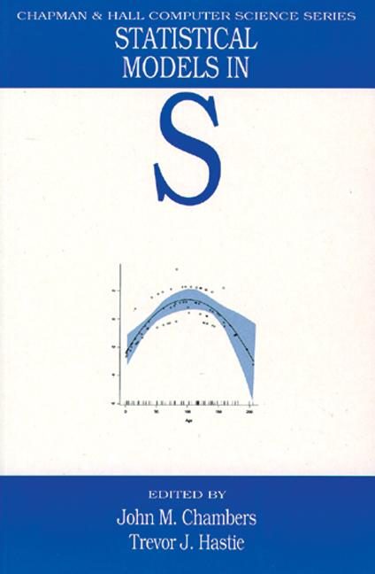
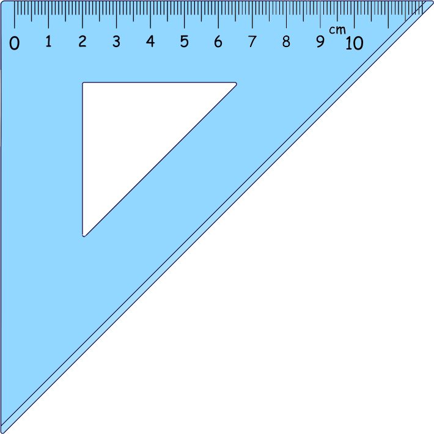

```{r include=F}
knitr::opts_chunk$set(fig.width=5, fig.height=5)
```

## Introduction

Why learn about linear models?

>* Encompass many common statistical methods
>* Starting point for more advanced statistics and machine learning
>* A core feature of R
>* Many Bioconductor packages assume users familiar with linear models

<br>
This will be only a taste of a big topic with a long history.


## Linear models

"linear model" "general linear model" "linear predictor" "regression" "multiple regression" "multiple linear regression" "multiple linear regression model"

Learn to predict a response variable as

* a straight line relationship with a predictor variable
* or more than one predictor variable
* actually it doesn't have to be a straight line
* some of the predictors could be categorical (ANOVA)
* and there could be interactions

<br/>

* test which variables and interactions the data supports as predictors
* give a confidence interval on any estimates


## Linear models in R

<div style="float: right; width: 25%; padding 2em;">
```{r echo=F,out.width="100%",fig.align="left"}

```
</div>

Many features of the S language (predecessor to R) were created to support working with linear models and its generalizations:

<br>

>* `data.frame` type introduced to hold data for modelling.

>* `factor` type introduced to hold categorical data.

>* `~` formula syntax specify terms in models.

>* Manipulation of "S3" objects holding fitted models.

>* Rich set of diagnostic visualization functions.

<br>

Primary reference is "Statistical models in S".


## Linear maths and R

A matrix in R is different from a data frame.

A matrix can be created from a vector using `matrix`, or from a data frame with `as.matrix`, or from multiple vectors with `cbind` (bind columns) or `rbind` (bind rows).

In maths we usually think of vectors as single column matrices, but these are different types in R.

Common operations:

<div style="margin-left:2em">
`sum(a*b)` - dot product of two vectors <br>
`A %*% B` - matrix product <br>
`A %*% b` - matrix times a vector (treated as a single colum) <br>
`t(A)` - matrix transpose (swap columns and rows)
</div>

## Geometry

<div style="float: left; width: 25%; padding: 2em">
The dot product is our ruler and set-square.

```{r echo=F,out.width="100%",fig.align="left"}

```
</div>

### Lengths

A vector can be thought of as an arrow in a space.

The dot product of a vector with itself $a^\top a$ is the square of its length. Pythagorus!

### Right angles

Two vectors at right angles have a dot product of zero. They are **orthogonal**.


## Models

A **model** can be used to predict a **response** variable based on a set of **predictor** variables. <span class="tip">*<span class="tiptext">Alternative terms: depedent variable, independent variables.<br><br>We are using causal language, but really only describing an association.</span></span>


The prediction will usually be imperfect, due to random noise.

<br>


## Linear model

A **response** $y$ is produced based on $p$ **predictors** $x_j$ plus noise $\varepsilon$ ("epsilon"):

$$ y = \beta_1 x_1 + \beta_2 x_2 + \dots + \beta_p x_p + \varepsilon $$

The model has $p$ **terms**, plus a noise term. The model is specified by the choice of **coefficients** $\beta$ ("beta").

This can also be written as a dot product:

$$ y = \beta^\top x + \varepsilon $$

<br>

The noise is assumed to be normally distributed with standard deviation $\sigma$ ("sigma") (i.e. variance $\sigma^2$):

$$ \varepsilon \sim \mathcal{N}(0,\sigma^2) $$

<br>

Typically $x_1$ will always be 1, so $\beta_1$ is a constant term in the model. We still count it as one of the $p$ predictors. <span class="tip">*<span class="tiptext">This matches what R does, but may differ from other presentations!</span></span>


## Model fitting -- estimating $\beta$

Say we have a observed $n$ responses $y_i$ with corresponding vectors of predictors $x_i$: 

$$ 
\begin{align}
y_1 &= \beta_1 x_{1,1} + \beta_2 x_{1,2} + \dots + \beta_p x_{1,p} + \varepsilon_1 \\
y_2 &= \beta_1 x_{2,1} + \beta_2 x_{2,2} + \dots + \beta_p x_{2,p} + \varepsilon_2 \\
    & \dots \\
y_n &= \beta_1 x_{n,1} + \beta_2 x_{n,2} + \dots + \beta_p x_{n,p} + \varepsilon_n 
\end{align}
$$

This is conveniently written in terms of a vector of responses $y$ and matrix of predictors $X$:

$$ y = X \beta + \varepsilon $$

Each response is assumed to contain the same amount of noise:

$$ \varepsilon_i \sim \mathcal{N}(0,\sigma^2) $$

## Model fitting -- estimating $\beta$ with geometry

$$ y = X \beta + \varepsilon $$
$$ \varepsilon_i \sim \mathcal{N}(0,\sigma^2) $$

**Maximum Likelihood**<span class="tip">*<span class="tiptext">"Likelihood" has a technical meaning in statistics: it is the probability of the *data* given the model parameters. This is backwards from normal English usage.</span></span> estimate:<br>
We choose $\hat\beta$ to maximize the likelihood of $y$.

A very nice consequence of assuming normally distributed noise is that the vector $\varepsilon$ has a spherical distribution, so the choice of $\hat\beta$ making $y$ most likely is the one that places $X \hat\beta$ nearest to $y$

Distance is the square root of the sum of squared differences in each dimension, so this is also called a **least squares** estimate. We choose $\hat \beta$ to minimize $\hat \varepsilon^\top \hat \varepsilon$.

$$ \hat \varepsilon = y - X \hat \beta $$


## Model fitting -- estimating $\beta$ with geometry

<div style="float: right; width: 15em;">
Imagine an experiment in which two noisy measurements of something are made.

Imagine many runs of this experiment.

The runs form a fuzzy circular cloud around the (noise-free) truth.
</div>

```{r echo=F}
source("../diagram.R")
begin()
many_exp()
the_truth()
```

## Model fitting -- estimating $\beta$ with geometry

```{r echo=F}
begin()
one_exp()
```


## Model fitting -- estimating $\beta$ with geometry

<div style="float: right; width: 15em;">
```{r}
y <- c(3,5)
fit <- lm(y ~ 1)

coef(fit)
predict(fit)
residuals(fit)
```
</div>

```{r echo=F}
begin()
to_predict()
```

## Model fitting -- estimating $\sigma$

<div style="float: right; width: 15em;">
The coefficient is wrong, but is our best estimate. It is an unbiassed estimate.

The residuals vector must be orthogonal to the subspace of possible predictions so it is too short, but we can correct for this to get an unbiassed estimate of the variance.

$$ \hat \sigma^2 = { \hat\varepsilon^\top \hat\varepsilon \over n-p } $$

```{r}
df.residual(fit)  # n-p
sigma(fit)
```
</div>

```{r echo=F}
begin()
to_predict()
the_truth()
```


## Model fitting in R

```{r eval=F}
lm(y ~ x1+x2+x3, data=mydata)
```

Our starting point for modelling is usually a data frame, but the process of getting $y$ and $X$ from the data frame has some complications, and a special "formula" syntax. 

```
        data frame

            ||
            || Magic involving "~" formula syntax happens
            \/

           y, X

            ||
            || Model fitting happens
            \/

        coef, sigma
```


## Formulas

```{r eval=F}
y ~ x1+x2+x3
```

"Wilikins-Rogers notation"

Formulas with `~` specify response $y$ and the construction of the model matrix $X$.

Terms refer to columns of a data frame or variables in the environment.

Merely a convenience, if you already have model matrix `X` can use `y ~ 0+X`.


## Formulas - intercept

Intercept term `1` is implicit.

Includes a column of 1s in the model matrix.

Coefficient represents the prediction when all other predictors are zero.

Omit with `-1` or `0`.

```{r eval=F}
# These mean the same thing:
y ~ 1+x
y ~ x


# No intercept:
y ~ 0+x
```

## Testing hypotheses

Two equivalent methods

**F test** 

```{r eval=F}
anova(fit0, fit1)`
```

>* Can we reject a simpler model formula based on a more complex one?
>* Model formulas must **nest**: any model using the simpler set of predictors must have an exact equivalent with the more complex set of predictors
>* Dropping a single predictor is a special case of this <br>(`summary( )` does this, uses t rather than F statistic but p-value is the same)

<br>
**Linear hypothesis test** 

```{r eval=F}
multcomp::glht(fit1, K)
```

>* Hypothesize that a linear combination of coefficients is zero 
>* Equivalent to first method, see `limma::contrastAsCoef( )`


## Confidence interval

>* Rather than removing a coefficient (or linear combination of coefficients), hypothesize it has some fixed value
>* Report the range in which such hypotheses are *not* rejected
>* Can see if effect is not just non-zero but of meaningful size


##

Do section: Single numerical predictor


## More on formulas - data types

`numeric` vector is represented as itself.

`logical` vector is converted to 0s and 1s.

`factor` is represented as $n_\text{levels}-1$ columns containing 1s and 0s. 

`matrix` is represented as multiple columns.


## More on formulas - factors

$n_\text{levels}-1$ columns of "indicator variables", for all but the first level of the factor. <span class="tip">*<span class="tiptext">The encoding can be adjusted using the `C( )` function within a formula. The default differs between S and R languages!</span></span>

Coefficients will represent difference from first level.

```{r}
f <- factor(c("a","a","b","b","c","c"))

model.matrix(~ f)
```


## More on formulas - factors and the intercept

R tries to be clever about factor encoding if intercept omitted.

Without intercept, coefficient represents the average for that level if all other predictors are zero.

```{r}
f <- factor(c("a","a","b","b","c","c"))
```

<div style="float: left; width: 15em;">
```{r}
model.matrix(~ f)
```
</div>

<div style="float: left; width: 15em;">
```{r}
model.matrix(~ 0+f)
```
</div>


## 

Do section: Single factor predictor


## More on formulas - calculations and function calls

Can calculate with function calls, or enclose maths in `I( )`.

Handy functions such as `poly` and `splines::ns` produce matrices for fitting curves.

```{r}
x <- 1:6
```

<div style="float: left; width: 15em;">
```{r}
model.matrix(~ x + I(x^2) + log2(x))
```
</div>

<div style="float: left; width: 15em;">
```{r}
model.matrix(~ poly(x,3))
```
</div>


## More on formulas - interactions

`a:b` specifies an interaction between `a` and `b`. 

All pairings of predictors from the two terms are multiplied together.

For logical and factor vectors, this produces the logical "and" of each pairing.
<br>&nbsp;

<br>

```{r}
model.matrix(~ f + x + f:x)
```

## More on formulas - interactions

`a*b` is shorthand to also include main effects `a + b + a:b`.

(More obscurely `a/b` is shorthand for `a + a:b`, if `b` only makes sense in the context of each specific `a`.)

<span style="display: inline-block; width: 6em">`(a+b+c)^2`</span> is shorthand for `a + b + c + a:b + a:c + b:c`.
<br>
<span style="display: inline-block; width: 6em">`a*b*c`</span> is shorthand for `a + b + c + a:b + a:c + b:c + a:b:c`.

<br>

```{r}
model.matrix(~ f*x)
```

##

Do section: Gene expression example

Do section: Testing many genes with limma

Do section: Fitting curves


## Summary

Should now be able to

>* specify linear models using formula notation
>* describe the meanings of coefficients
>* check residuals
>* recognize if log transformation is needed
>* test hypotheses
>* calculate confidence intervals


## Extensions to linear models

It's possible to treat gene expressions (and other "high-throughput" measurements) either as responses or as predictors.

### Many responses

>* use limma to fit and test many models

### Many predictors, $p > n$

>* regularization with ridge regression and/or LASSO: `glmnet::glmnet( )`
>* Principal Component Regression (PCR)<br>(direction of largest variation in X first)
>* Partial Least Squares (PLS) <br>(pick best direction to start moving in and take best leap along it, repeat)


## Extensions to linear models

### Noise not normal (eg binary or count data)

>* Generalized Linear Models: `glm( )`<br>(logistic regression, binomial, Poisson, negative binomial, gamma, etc)
>* Quasi-Likelihood F-test in case of over-dispersion

### Survival time, with censoring

>* Cox survival model: `survival::coxph( )`


## Extensions to linear models

### Noise at a coarser grain than single measurements

Individuals tracked over time, repeated measurements, blocks/batches/plots, etc.

>* Generalized Least Squares (accounts for covariance in noise)
>* Mixed Model (some coefficients are drawn from a random distribution)

### Response is non-linear in predictors

>* Feature engineering: `poly( )`, `splines::ns( )`
>* Local regression (LOESS): `loess( )`
>* Generalized Additive Models (GAM): `mgcv::gam( )`<br>(splines with regularization)
>* Neural network (plug together many logistic regression models)

Also consider tree methods, such as gradient boosted trees.


## Further reading

<div style="float: right; width: 25%; padding 2em;">
```{r echo=F,out.width="100%",fig.align="left"}

```
</div>

**Primary reference is:**

Chambers and Hastie (1991) "Statistical Models in S"

<br>
**Also good:**

Faraway (2014) "Linear Models with R"

James, Witten, Hastie and Tibshirani (2013) "An Introduction to Statistical Learning"


